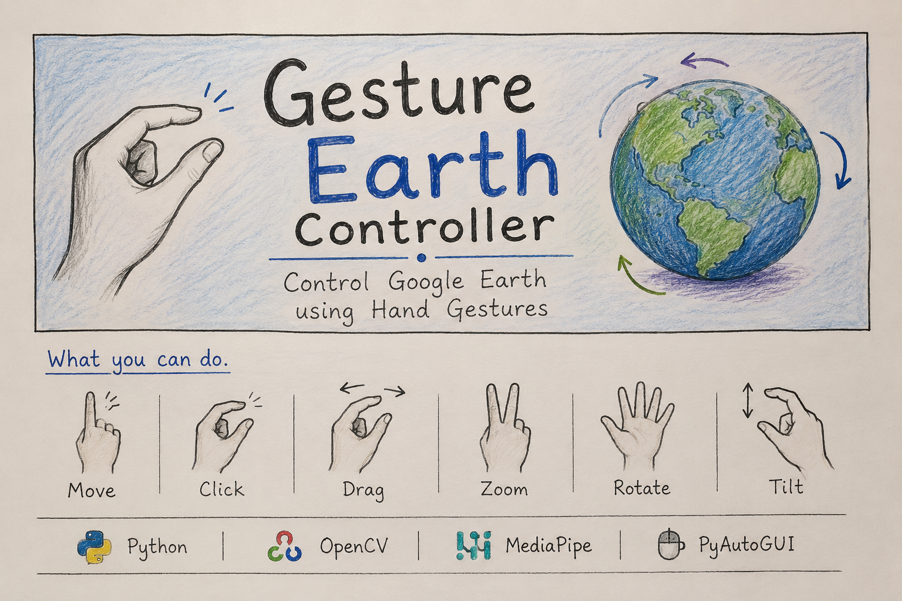

<p align="center">
  
</p>

# 🌍 Gesture Earth Controller

Control **Google Earth** using intuitive hand gestures powered by **MediaPipe**, **OpenCV**, and **PyAutoGUI**.

Gesture Earth Controller is a computer vision project that enables touch-free navigation of Google Earth using a webcam. Users can move the cursor, click, drag, zoom, rotate, and tilt the Earth with natural hand gestures.

---

## ✨ Features

- 🖱️ Cursor Movement
- 👆 Click Detection
- 🤏 Drag & Drop
- 🔍 Zoom In / Zoom Out
- 🌎 Earth Rotation
- 🎥 Earth Tilt
- 📊 Live Dashboard
- ⚡ Smooth Cursor Tracking
- 🎯 Real-time Hand Tracking using MediaPipe

---

## 🖐️ Supported Gestures

| Gesture | Action |
|----------|--------|
| ☝️ Index Finger | Cursor Movement |
| 🤏 Thumb + Index Pinch | Click |
| 🤏 Hold Pinch | Drag |
| ✌️ Index + Middle | Zoom |
| 🖐️ Open Palm | Rotate Earth |
| 🤏🤏 Double Pinch + Drag | Tilt Earth |

---

## 📂 Project Structure

```text
gesture-earth/
│
├── .gitignore
├── LICENSE
├── README.md
├── requirements.txt
│
├── main.py
├── config.py
├── gestures.py
├── utils.py
├── cursor.py
├── click_drag.py
├── zoom.py
└── rotate.py
```

---

## ⚙️ Requirements

- Windows 10 / Windows 11
- Python **3.12.3** (Tested)
- Webcam

---

## 🚀 Installation

Clone the repository

```bash
git clone https://github.com/henston-dza/gesture-earth.git
```

Move into the project

```bash
cd gesture-earth
```

Create a virtual environment

```bash
python -m venv venv
```

Activate it

### Windows

```bash
venv\Scripts\activate
```

Install dependencies

```bash
pip install -r requirements.txt
```

Run the application

```bash
python main.py
```

---

## ⌨️ Keyboard Shortcuts

| Key | Function |
|-----|----------|
| H | Toggle Dashboard |
| D | Toggle Hand Landmarks |
| Q | Quit Application |


---

## 🎥 Demo

A full demonstration of Gesture Earth Controller is available here:

🔗 LinkedIn Post:
https://www.linkedin.com/posts/henston-melroy-dsouza_python-computervision-mediapipe-ugcPost-7478811191033643008-d7gI/utm_source=social_share_send&utm_medium=member_desktop_web&rcm=ACoAAEvlPaUBVB_3EiuU4wV9mAZEFjrA2scFFgQ

---

## ⚠️ Known Limitations

- The OpenCV preview window temporarily pauses while it is being moved. This is a limitation of OpenCV's HighGUI window system.
- For best performance, keep the camera preview window focused while using keyboard shortcuts.
- Tested on Windows 11 with Python 3.12.3.

---

## 🔮 Future Improvements

- Multi-hand support
- Custom gesture mapping
- Gesture calibration
- Cross-platform support
- GUI settings panel
- Gesture sensitivity adjustment
- Voice command integration

---

## 🛠️ Technologies Used

- Python
- OpenCV
- MediaPipe
- PyAutoGUI

---

## 📄 License

This project is licensed under the MIT License.

---

## 👨‍💻 Author

**Henston Dsouza**

GitHub: https://github.com/henston-dza
